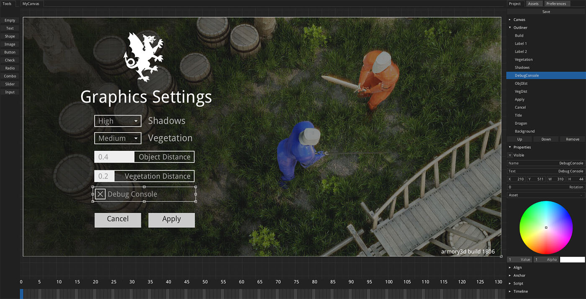

# armory2d

Stand-alone 2D editor focused on games. Used in Armory, written in Haxe and Kha.

Armory2D outputs a json or binary file representing the scene components. This file can be rendered through [Zui library](https://github.com/armory3d/zui/tree/master/examples/Canvas). Alternatively, it is possible to implement and read the [Canvas](https://github.com/armory3d/zui/blob/master/Sources/zui/Canvas.hx#L68) structure manually in any application.

## Clone repository

- `git clone --recursive https://github.com/armory3d/armory2d`
- `cd armory2d`
- `git submodule foreach --recursive git pull origin master`
- `git pull origin master`

## Run in KodeStudio (HTML5)

- Drop cloned `armory2d` folder into [KodeStudio](https://github.com/Kode/KodeStudio/releases)

## Build for Armory (Krom)

### Windows

- `node Kha/make krom -g direct3d11`
- Copy files from `build/krom` to `ArmorySDK/lib/armory_tools/armory2d/d3d11`

### Linux / macOS

-  `node Kha/make krom -g opengl`
- Copy files from `build/krom` to `ArmorySDK/lib/armory_tools/armory2d/opengl`
