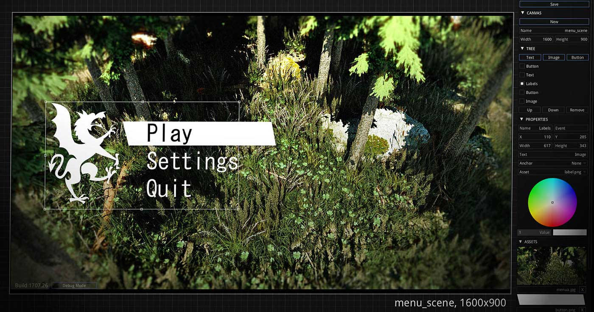

# armorui



Stand-alone UI editor focused on games and simulations. Used in Armory, written in Haxe and Kha.

ArmorUI outputs a json (or binary) file representing the scene components. This file can be rendered through [Zui library](https://github.com/armory3d/zui/tree/master/examples/Canvas). Alternatively, it is possible to implement the [Canvas](https://github.com/armory3d/zui/blob/master/Sources/zui/Canvas.hx#L68) structure manually in any application.


## Run

```
git clone https://github.com/armory3d/armorui
cd armorui/build/krom
```

Windows
```
./run_windows.bat
```

Linux
```
./run_linux.sh
```

MacOS
```
./run_macos.sh
```

Reads `prefs.json` file located in `build/krom` to get the input canvas path.


## Build

[Node](https://nodejs.org) and [Git](https://git-scm.com) required.

1. Recursive clone

```
git clone --recursive https://github.com/armory3d/armorui
cd armorui
git submodule foreach --recursive git pull origin master
git pull origin master
```

2. a) Compile Krom
```
node Kha/make krom
```

2. b) Compile C++
```
node Kha/make --compile
```

2. c) Compile HTML5
```
node Kha/make html5
```

## Tech

- [Zui](https://github.com/armory3d/zui)
- [Kha](https://github.com/Kode/Kha)
- [Krom](https://github.com/Kode/Krom)
- [Haxe](https://github.com/HaxeFoundation/haxe)
